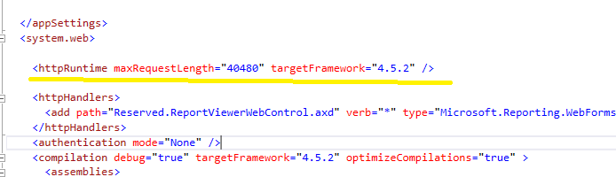
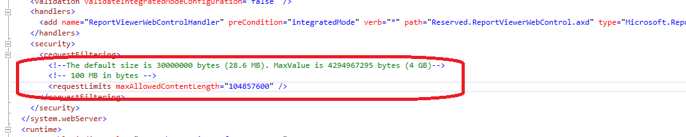
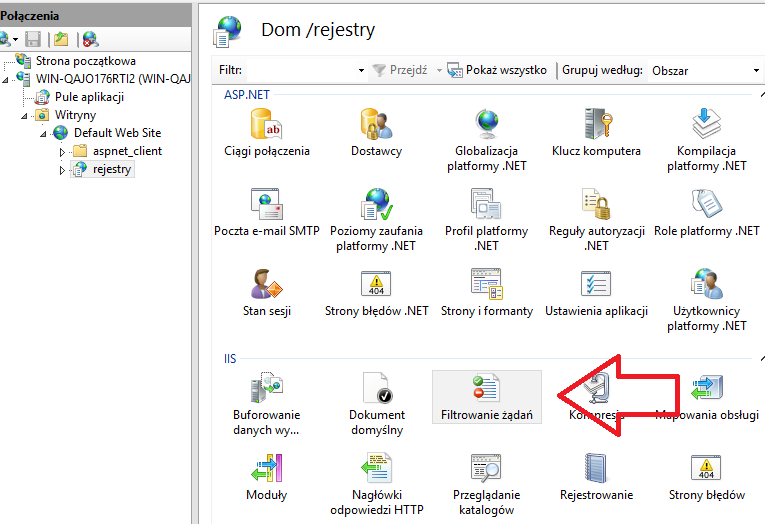
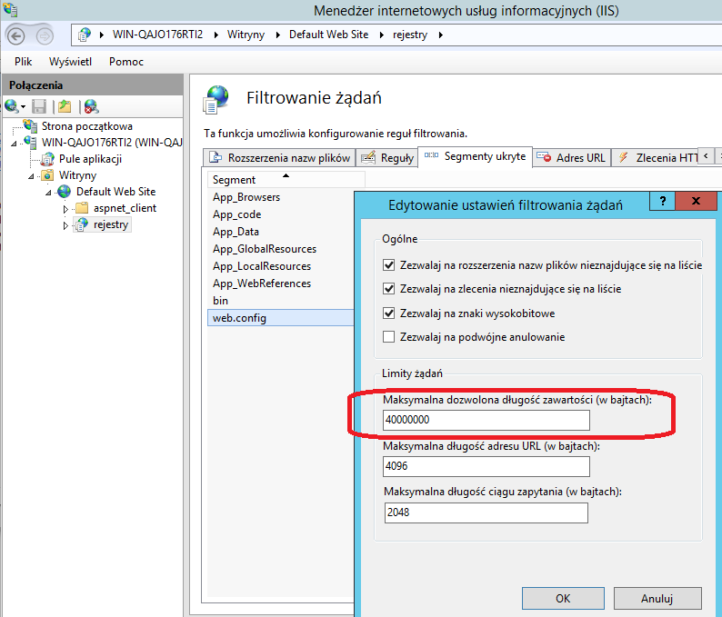

#### Jak zwiększyć limit  rozmiaru plików (skanów) zapisywanych do bazy

####
Za limit  rozmiaru plików  przesyłanych do bazy odpowiada zmienna    maxRequestLength, którą ustawia się w pliku web.config

Standardowo nie występuje ona w pliku web.config a limit rozmiaru plików wynosi 4MB.

Umieszcza się ją w sekcji "system.web" i tak maxRequestLength="40480"  zwiększa limit do 40MB.

Należy też sprawdzić wielkość parametru maxAllowedContentLength

Jego wartość można także zmienić za pomocą manadżera IIS

####
