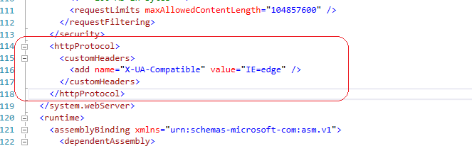

#### W IE 11 nie działają niektóre funkcjie np. wybieranie daty z kalendarza

W plku web.config w sekcji system.webServer należy dodać 

>  <httpProtocol>
>      <customHeaders>
>        <add name="X-UA-Compatible" value="IE=edge" />
>      </customHeaders>
>  </httpProtocol>

